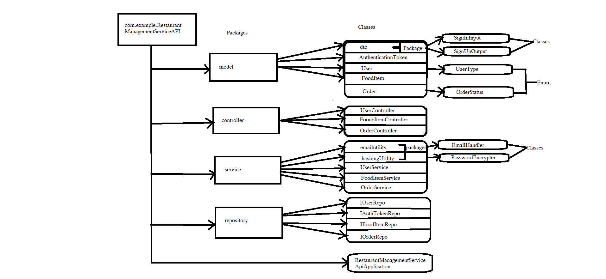

## Frameworks and language used 
* SpringBoot Framework and java language.
## Data Flow

## DataBase Design

## Data Structure used in your project
* Arraylist
## Project Summary

This is the "Restaurant Management Service API Application" which following the mvc-Architecture.In this application, I have created a package of RestaurantManagementServiceApiApplication within this package I have created Four more packages to define layer as given in DFD. This project has three Model User which has three types of user,"Admin , Normal_User , Visitor ",foodItem And Order, order has foreign key of userId and foodItemId which performing many-to-one relation between them. The extra model is for authentication of user who has done signUp / signIn or not.
Every User has unique email address and we get authorized through that email which generating token to making us accessible through out the site.But condition is, only Admin kind of user can able to create food Item On the other hand, Normal_User kind of user can able to generate Food Orders multiple Orders can be order by single User so thats why we using many-to-one mapping on order and user where user is reference side and order is owning side so that's ,we are performing many-to-one mapping on it.And storing the data in mySQL using the dependency MYSQL Driver And JPA.For posing the data, we are performing crud operations on it with the help of endpoints like @GetMapping to get all the information of the Model, @PostMapping to create a Model Information using the attributes, @deleteMapping to remove a Model related Information from list by giving specific Model Id .That's the whole project meant. 